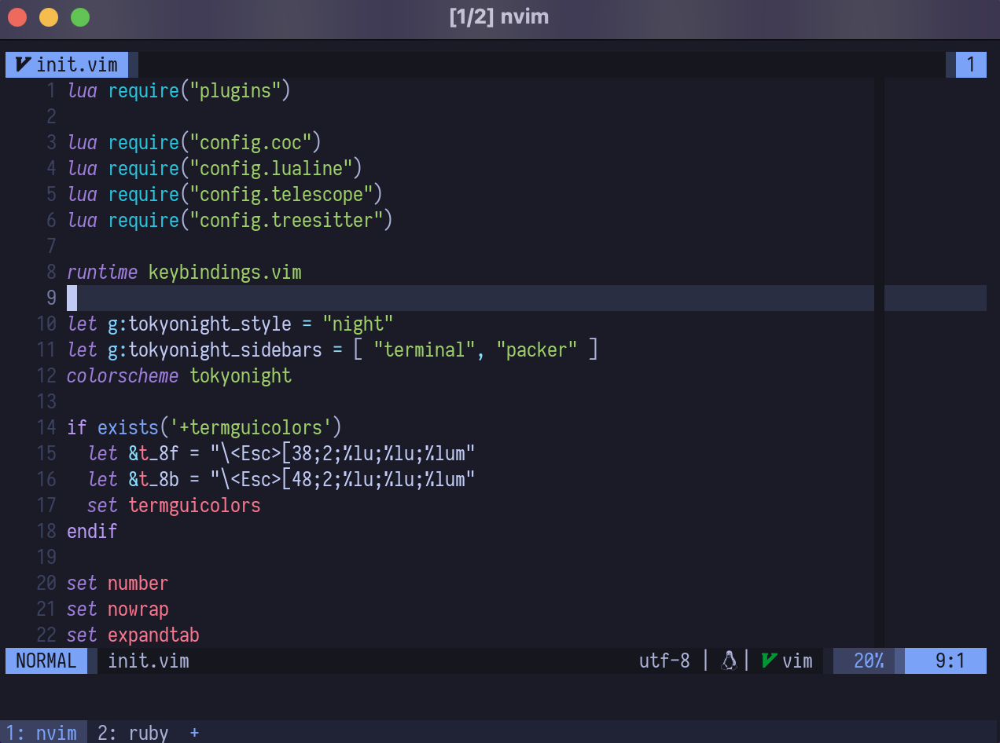
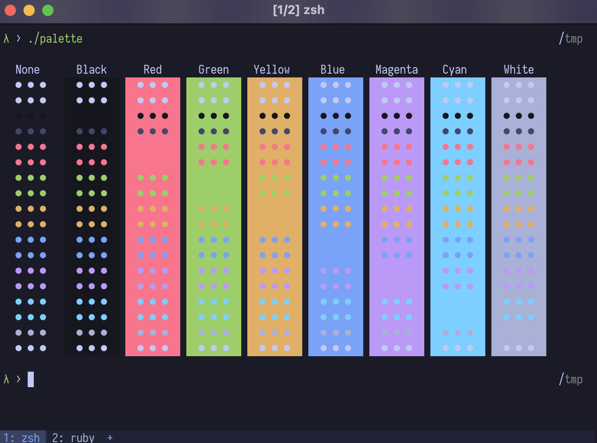

# dotfiles

Personal dotfiles configuration. What's included?
- [wezterm](https://wezfurlong.org/wezterm/)
- zsh
- neovim

## Usage

dot files management using [GNU/stow](https://www.gnu.org/software/stow/).

TL;DR

```sh
stow -t $HOME <pkg> # pkg can be wezterm, or zsh, or nvim, etc..
```

## Notes

### Additional steps for zsh

zsh plugin manager using [antibody](https://getantibody.github.io/), generate bundles.zsh with this command,

```sh
antibody bundle < ~/.zsh/bundles > ~/.zsh/bundles.zsh
```

### Additional steps for neovim

neovim plugin manager using [packer.nvim](https://github.com/wbthomason/packer.nvim). Install packer with this command,

```sh
git clone --depth 1 https://github.com/wbthomason/packer.nvim\
 ~/.local/share/nvim/site/pack/packer/start/packer.nvim
```

Then do `:PackerInstall` inside nvim.

### Additional steps for fzf

fzf key bindings are heavily used in the workflow, after install fzf, add (source) the included `key-bindings.zsh` from installation files to `$HOME/.zsh/keybinding.zsh`

## Screenshots




